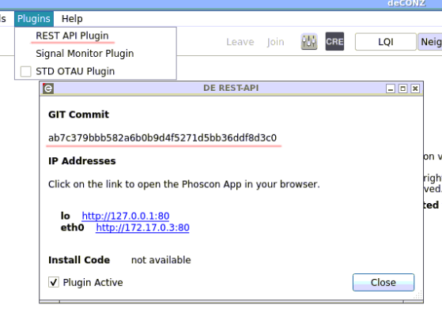

# Test deconz-rest-plugin with docker

This builds the deconz-rest-plugin and injects it into a new [deconzcommunity/deconz](https://github.com/deconz-community/docker-deconz) docker image.

**Only tested in amd64.**

How to use it (example):

```
# Guarantee we work on latest deconzcommunity/deconz image
docker pull deconzcommunity/deconz
# Build new image
docker build -t my-deconz-image --build-arg PLUGIN_REPOSITORY=https://github.com/dresden-elektronik/deconz-rest-plugin.git --build-arg PLUGIN_GIT_COMMIT=f52b882536358bd7c722a8fa9894d283cbcaa6d5 .
```

Arguments:
* PLUGIN_REPOSITORY (optional, default: https://github.com/dresden-elektronik/deconz-rest-plugin.git) - If you are testing a fork, just set it to your repository.
* PLUGIN_GIT_COMMIT (optional, default: master) - In the repository mentioned in PLUGIN_REPOSITORY, which commit do you want to test? Here is where you put the commit hash.

Once built, you can run it exactly the same way as you would run a [deconzcommunity/deconz](https://github.com/deconz-community/docker-deconz) image - just replace the image name with `my-deconz-image`.

Example:

```
docker run -d \
    --name=deconz \
    -p 80:80 \
    -p 443:443 \
    -p 5900:5900 \
    --restart=always \
    --device=/dev/ttyUSB0 \
    -e DECONZ_WEB_PORT=80 \
    -e DECONZ_WS_PORT=443 \
    -e DECONZ_VNC_MODE=1 \
    -e DECONZ_VNC_PORT=5900 \
    my-deconz-image
```

## How to check if it worked

Once your docker image is successfully started, you can access it with a VNC client (e.g. Remmina) on port 5900. In the GUI, access `plugins->rest plugin`. In the window that opens, you should see the commit hash that you mentioned in the docker build command:


